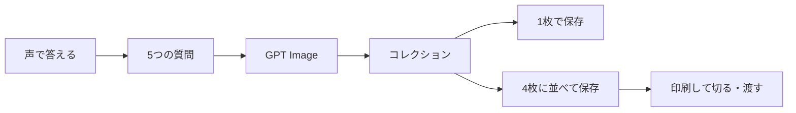

# ぺたっと

> 声でつくって、集めて、きって、渡せる。<br>
> 子どもの空想を、シール帳に入る小さな作品へ。

**OpenAI Build Week Challenge 提出作品** — Flutter / GPT Image / Codex

## プロダクト

「ぺたっと」は、子どもとの短い音声会話からオリジナルのコレクションシールをつくるモバイルアプリです。

口のアイコンを押すと、アプリが「どんな生き物？」「何色？」「どんな顔？」と一問ずつ尋ねます。答えをもとにGPT Imageが正方形のシールを生成。完成品はコレクションに残り、1枚の保存用画像、または同じシールを4枚に並べた**切り取り用画像**として端末へ保存できます。



## なぜシールなのか

シールは、子どもにとって単なる画像ではありません。集める、眺める、選ぶ、交換するという、対面のコミュニケーションを生む小さなメディアです。

- ニフティキッズの2,484人調査では、小学生の77.5%がシール集めに「ハマっている」と回答。シール帳を持つ小学生の90%はシール交換をすると答えています。自社サイト来訪者へのオンライン調査であり全国推計ではありませんが、交換が子ども同士の会話に結びついていることを示します。 [調査概要](https://edu.watch.impress.co.jp/docs/news/2088861.html)
- タカラトミーは、キデイランド等68店舗におけるシール売上が前年比161%と発表し、コレクションや交換を「日常のコミュニケーションのきっかけ」と位置づけています。 [公式発表](https://www.takaratomy.co.jp/product_release/pdf/p260413.pdf)
- ファミリーマートでは、スマホの画像をマルチコピー機でスクエアシール紙に出力できます。スクエアシールは250円で、対応店舗・機種に限られますが、デジタルの絵を手で渡せるものに変える最後の一歩は身近にあります。 [公式案内](https://www.family.co.jp/services/print/print.html?code=line)

一方、交換には希少性や「レート」が生まれ、得・損を感じる子どももいます。ぺたっとは価値を判定したり、人気シールの代替を競わせたりしません。**自分のアイデアからつくった、渡してよいシール**を増やすことで、交換や見せ合いの入口を少しやさしくします。

## 体験設計

1. **話す** — 読み書きの前に、声で始める。
2. **一問ずつ決める** — 生き物・形・色・顔・性格の5項目に分け、空白のプロンプトを子どもと一緒に埋める。
3. **待つ時間もキャラクターにする** — 生成中はキャラクターの目が回り、完成前の時間を「処理待ち」ではなく期待の演出に変える。
4. **集める** — 完成品はコレクションに追加され、つくったことが残る。
5. **現実へ持ち出す** — 1枚または4枚の画像として保存して、家庭のプリンタやコンビニ印刷から切り取って使える。

対象を性別で決めつけず、シールを集める・飾る・交換することを楽しみたい子どもと、その保護者を想定しています。

## Build Weekで示すこと

OpenAI Build Weekは、技術実装、デザインとUX、潜在的インパクト、アイデアの質、そしてCodexの思慮深い活用を評価します。 [公式の評価基準](https://openai.com/build-week/)

| 観点 | ぺたっとのアプローチ |
| --- | --- |
| **Codex活用・技術実装** | Codexを使い、Flutterの画面遷移、音声認識・音声合成、Image API、画像保存、4面付け画像の合成までを一つの実機MVPへ実装した。シールの仕様は5つの会話回答を構造化して画像プロンプトへ渡すため、子どもの言葉がデザイン条件として残る。 |
| **デザイン / UX** | フォーム入力ではなく、口のアイコンと一問ずつの会話から始める。キラキラした視覚言語、生成中の表情、完成後のコレクションにより、技術の待ち時間も遊びの流れに組み込む。 |
| **実社会へのインパクト** | AI生成を画面の中だけで終わらせず、4枚に面付けして保存する。保護者と印刷し、ノートに貼る・友だちに渡すというオフラインの自己表現と会話につなげる。 |
| **アイデアの新規性** | 画像生成そのものではなく、子どもの発話を「集められ、使え、共有できる」シールへ変える体験が中心。会話、生成、コレクション、印刷用の4面付けをひと続きに設計している。 |

## 実装

| 領域 | 実装 |
| --- | --- |
| アプリ | Flutter / Material 3 |
| 音声入力 | `speech_to_text` による端末の日本語音声認識 |
| 音声出力 | `flutter_tts` による一問ずつの問いかけ |
| 画像生成 | `gpt-image-2` / `1024×1024` / `medium`。5つの回答を`CharacterSpec`としてJSON化し、プロンプトへ埋め込む |
| 画像処理 | Dartの`dart:ui`で1枚の画像を4面にレイアウトし、カットガイドを含む`2048×2048` PNGを生成 |
| 保存 | `gal`で写真ライブラリへ保存。コレクション画面から1枚または4面付け画像を選ぶ |
| 検証 | Widget testで作成画面とコレクション画面の入口を確認 |

主なコード：

- [アプリ起動とテーマ](lib/main.dart)
- [作成画面・コレクション・4面付け画像](lib/screens/home_screen.dart)
- [音声質問フロー](lib/screens/voice_session_screen.dart)
- [Image API呼び出しと安全な生成条件](lib/services/sticker_api.dart)

## 子どものためのガードレール

- 生成プロンプトでは既存ブランド、既存キャラクター、既存作品の模倣、ロゴ、文字、切り取り線を禁止する。
- 明るく親しみやすい6〜10歳向けの正方形イラスト、中央に大きなキャラクター、十分な余白を指定する。
- 交換は任意であり、価値やレートを判定しない。家庭・学校のルールを優先する。

## 起動

```sh
flutter pub get
flutter run --dart-define=OPENAI_API_KEY=sk-...
```

初回はマイクと写真ライブラリへの権限を求めます。

## テスト

```sh
flutter analyze
flutter test
flutter build ios --simulator --no-codesign
```
